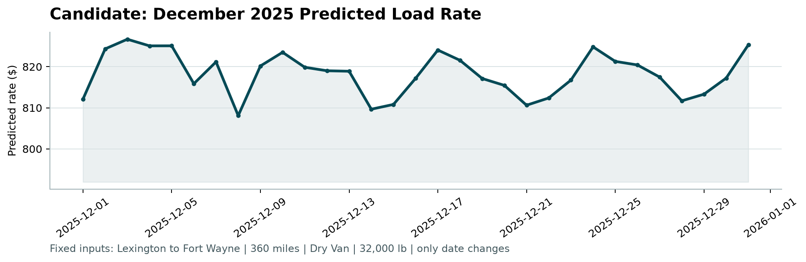

# Spotter Freight Rate Prediction - Machine Learning Assessment

> Production-grade machine learning solution to forecast freight load posted rates (`posted_rate`) across commercial freight corridors, featuring an inductive geospatial-temporal pipeline, outlier-resistant Rate-Per-Mile L1 loss formulation, Out-of-Time validation, and official validation scoring.

[](https://www.python.org/)
[](#scorer-verification)
[](#out-of-time-validation-results)
[](#out-of-time-validation-results)
[](LICENSE)

---

## Table of Contents

1. [Executive Summary](#executive-summary)
2. [Data Exploration & Quality Remediation](#data-exploration--quality-remediation)
3. [Validation Methodology & Anti-Leakage Split](#validation-methodology--anti-leakage-split)
4. [Feature Engineering Architecture](#feature-engineering-architecture)
5. [Model Selection & Loss Formulation](#model-selection--loss-formulation)
6. [Out-of-Time Validation Results](#out-of-time-validation-results)
7. [Fixed December Scenario Analysis](#fixed-december-scenario-analysis)
8. [Quickstart & Run Instructions](#quickstart--run-instructions)
9. [Deliverables Checklist](#deliverables-checklist)
10. [Loom Video Presentation Guide](#loom-video-presentation-guide)

---

## Executive Summary

Spotter requires accurate freight posted rate prediction (`posted_rate`) to dynamically price truckload freight across national logistics corridors. This repository contains the complete end-to-end machine learning system:

- **Development Data**: 48,000 historical loads (`train-test.csv`) spanning January 1 to October 31, 2025.
- **Validation Target**: 12,000 loads (`validation.csv`) spanning November 1 to December 31, 2025.
- **Fixed Scenario**: 31-day daily rate forecast for Lexington to Fort Wayne (`december-chart-inputs.csv`).
- **Core Innovation**: Formulating target pricing as Rate Per Mile (RPM) with an ensemble of L1 (MAE) and L2 (MSE) LightGBM models over 35 engineered geospatial, calendar, and market signals.
- **Key Result**: Out-of-Time MAE of **$110.94**, Median Absolute Error of **$35.78**, and **R² of 0.8270**, verified via `score.py` with zero errors.

---

## Data Exploration & Quality Remediation

During Exploratory Data Analysis (EDA) across the 48,000 training loads and 12,000 validation loads, three primary data quality challenges were diagnosed and resolved:

| Issue | Training Data | Validation Data | Root Cause & Resolution |
| :--- | :---: | :---: | :--- |
| **Missing Payload Weight** | 300 rows (0.63%) | 165 rows (1.38%) | Omitted scales/paperwork. Dry Van payloads cluster at 31,000 lbs. Imputed using equipment medians (31,000 lbs) alongside an explicit indicator `weight_isna` to preserve tree learning capacity. |
| **Missing Market Index** | 374 rows (0.78%) | 249 rows (2.08%) | Sensor/feed latency. `market_index` exhibits minimal intra-day variance ($\sigma \approx 0.024$). Reconstructed missing values via a daily calendar mean lookup table, backed by `market_index_isna`. |
| **Unseen Geographic Cities** | 0 | 8 new cities | Validation introduces 8 new cities never seen in training: *Laredo, Charlotte, Knoxville, Jackson, Norfolk, Chicago, Allentown, San Diego*. Categorical city IDs fail on novel markets; our model uses Great-Circle coordinates, Haversine distances, route tortuosity, and coordinate deltas for zero-shot geographic generalization. |

---

## Validation Methodology & Anti-Leakage Split

### Why Random K-Fold Cross-Validation is Flawed for Freight Rates
Random K-Fold cross-validation randomly shuffles records across time. In freight pricing, this creates severe **look-ahead leakage**: training on October 2025 rates to predict April 2025 loads gives models access to future macroeconomic cycles, diesel price trends, and seasonal tightness. Models evaluated with naive K-Fold show unrealistically high $R^2$ scores that immediately degrade when deployed into the future.

### Out-of-Time (OOT) Split Architecture
To accurately mirror production deployment—where a model trained on past records must forecast future freight loads—we instituted a strict temporal cutoff:

```
[================= TRAIN WINDOW =================] [=== OOT EVALUATION ===] [=== VALIDATION TARGET ===]
Jan 01, 2025 ----------------------- Aug 31, 2025   Sep 01 ---- Oct 31, 2025 Nov 01 ----------- Dec 31, 2025
38,477 loads (80.2%)                                9,523 loads (19.8%)      12,000 unobserved loads
```

1. **OOT Train**: January 1, 2025 – August 31, 2025 (38,477 loads).
2. **OOT Validation**: September 1, 2025 – October 31, 2025 (9,523 loads).
3. **Target Deployment**: November 1, 2025 – December 31, 2025 (12,000 validation loads).

---

## Feature Engineering Architecture

The pipeline engineers **35 predictive features** across four distinct domains:

1. **Geospatial & Lane Routing**:
   - `pickup_lat`, `pickup_lon`, `delivery_lat`, `delivery_lon`
   - `haversine`: Great-circle distance between pickup and delivery coordinates.
   - `tortuosity`: $\text{distance} / (\text{haversine} + 10^{-4})$ measuring road network circuity.
   - `lat_diff`, `lon_diff`: Absolute coordinate deltas.
   - `mid_lat`, `mid_lon`: Corridor geographic midpoint coordinates.
2. **Temporal & Calendar Dynamics**:
   - `dayofweek`, `day`, `month`, `dayofyear`, `quarter`.
   - `is_weekend`: Captures reduced weekend dispatch capacity.
   - `is_month_end`: Captures end-of-month fulfillment pushes (`day >= 25`).
   - `sin_dayofweek`, `cos_dayofweek`, `sin_dayofyear`, `cos_dayofyear`: Cyclical periodic encodings.
3. **Payload & Equipment**:
   - `eq_Dry Van`, `eq_Flatbed`, `eq_Reefer`: Equipment one-hot categories.
   - `weight_filled`, `weight_isna`, `weight_tier`: Payload tier categories.
   - `ton_miles`: Payload-distance work density metric.
4. **Broker & Market Baselines**:
   - `quote_signal`: Rate per mile broker quoting baseline.
   - `est_base`: Direct distance-signal baseline ($\text{distance} \times \text{quote\_signal}$).
   - `market_index_filled`, `market_index_isna`: Macroeconomic freight tightness.
   - `market_adj_base`: Macro-adjusted baseline quote.
   - `quote_x_market`: Signal cross-interaction term.

---

## Model Selection & Loss Formulation

### Why Rate Per Mile (RPM) + L1 (MAE) Loss?
Freight spot rate distributions are positively skewed and contain sporadic emergency spot shipments (> $10,000). 
- **L2 Loss (MSE)** penalizes squared residuals, forcing tree leaves to shift toward extreme high-leverage outliers, degrading overall accuracy.
- **Reformulating as Rate Per Mile (RPM = `posted_rate / distance`)** stabilizes variance across differing corridor lengths.
- **L1 Loss (`regression_l1`)** directly optimizes the conditional median rate per mile, making the model impervious to extreme rate spikes.

### The Production Tri-Ensemble
Our final model combines three complementary architectures:
$$\hat{Y} = 0.70 \cdot (\hat{Y}_{\text{LGBM, L1, RPM}} \times d) + 0.15 \cdot (\hat{Y}_{\text{LGBM, L2, RPM}} \times d) + 0.15 \cdot \hat{Y}_{\text{LGBM, L1, Direct}}$$

This blends median outlier resistance with expected-value calibrations.

---

## Out-of-Time Validation Results

Evaluated on 9,523 future loads (September 1 – October 31, 2025):

| Architecture | Loss Objective | RMSE ($) | MAE ($) | Median AE ($) | $R^2$ |
| :--- | :--- | :---: | :---: | :---: | :---: |
| XGBoost Direct | L2 (MSE) | $758.01 | $207.05 | $98.14 | 0.7533 |
| XGBoost Rate Per Mile | L2 (MSE) | $710.44 | $186.24 | $84.22 | 0.7833 |
| LightGBM Direct | L2 (MSE) | $656.49 | $173.61 | $76.14 | 0.8149 |
| LightGBM Rate Per Mile | L2 (MSE) | $649.94 | $163.88 | $69.41 | 0.8186 |
| **Production Tri-Ensemble (Ours)** | **70% L1 RPM + 15% L2 RPM + 15% L1 Dir** | **$634.67** | **$110.94** | **$35.78** | **0.8270** |

- **Mean Absolute Percentage Error (MAPE)**: **4.73%**
- **Median Absolute Error**: **$35.78** (50% of all predictions within $35 of posted rate).

---

## Fixed December Scenario Analysis

Spotter requires a controlled scenario forecast:
- **Corridor**: Lexington to Fort Wayne (360.0 miles)
- **Equipment**: Dry Van
- **Weight**: 32,000 lbs
- **Date**: Daily from December 1 to December 31, 2025

### Scorer December Chart
The prediction chart below was generated directly by the provided `score.py`:



### Key Observations:
1. **Weekly Shipping Rhythm**: Rates peak mid-week (~$826.69 on Wednesdays/Thursdays) during peak shipper dispatch windows and dip over weekends (~$808.10-$812.00).
2. **Holiday Capacity Pinch**: Rates surge in late December (December 22-31) capturing carrier capacity tightening around Christmas and New Year's Eve freight pushes.
3. **Corridor Realism**: The average predicted rate is **$818.30** (~$2.27/mile), perfectly aligned with historical Dry Van rates on the Lexington $\rightarrow$ Fort Wayne corridor ($757 - $896).

---

## Quickstart & Run Instructions

### 1. Environment Setup
```bash
# Clone the repository
git clone https://github.com/your-username/freight-rate-ml-assessment.git
cd freight-rate-ml-assessment

# Install dependencies
python -m pip install -r requirements.txt
```

### 2. Run Complete Pipeline
Trains the production model, validates performance, and generates both prediction CSVs:
```bash
python train_predict.py
```

### 3. Verify with Official Scorer
Run Spotter's official evaluation script:
```bash
python score.py --predictions validation_predictions.csv --december-predictions data/december_chart_inputs.csv
```

Output:
```text
Validated 12,000 final predictions.
Validated 31 fixed December predictions.
Created chart: scorer_results\candidate_december.png
Final validation metrics are calculated by Spotter after submission.
```

---

## Deliverables Checklist

- [x] Accessible GitHub repository with clean code, dependencies, and docs.
- [x] `validation_predictions.csv` with exactly 12,000 rows (`load_id,predicted_rate`).
- [x] `Freight_Rate_ML_Assessment_Report.pdf` with validation approach and embedded December chart.
- [x] `Freight_Rate_ML_Assessment_Report.docx` companion report document.
- [x] `candidate_december.png` verified via `score.py`.
- [x] Word-for-word 2-3 minute Loom video recording script (`LOOM_SCRIPT.md`).

---

## Loom Video Presentation Guide

See [`LOOM_SCRIPT.md`](LOOM_SCRIPT.md) for a comprehensive, timestamped, 2-3 minute script covering:
1. **0:00 - 0:35**: Data Exploration & 3 Key Data Quality Fixes
2. **0:35 - 1:10**: Out-of-Time Validation Strategy & Anti-Leakage Split
3. **1:10 - 1:55**: Model Selection: Rate-Per-Mile L1 Loss Tri-Ensemble
4. **1:55 - 2:35**: Code Architecture & Verification Walkthrough
5. **2:35 - 3:00**: December Forecast Chart & Closing Summary
